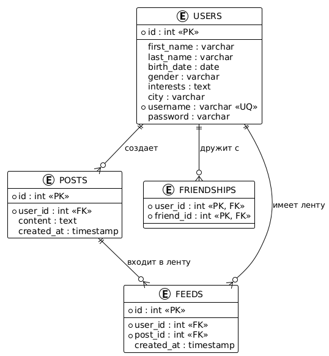

# Кеширование

## Конфигурация и инфраструктура


Redis настроен для кеширования лент пользователей:
 - Использованы Sorted Sets для эффективного хранения и сортировки постов
 - Настроено время жизни кешей для предотвращения устаревания данных

Kafka использован для асинхронной обработки обновлений:

 - Настроен топик feed-updates с партициями для масштабируемости
 
Docker Compose настроен для развертывания всей инфраструктуры:

 - Контейнеры для PostgreSQL, Redis, Kafka и Zookeeper


## Структура данных

На основе существующей таблицы users я создал три дополнительные таблицы:

 - friendships - для хранения отношений между пользователями:

    user_id - ID пользователя
    friend_id - ID друга
    Первичный ключ на паре (user_id, friend_id)

 - posts - для хранения постов пользователей:

    id - уникальный идентификатор поста
    user_id - ID автора поста
    content - содержимое поста
    created_at - время создания поста

 - feeds - вспомогательная таблица для возможности перестройки кеша лент:

    user_id - ID пользователя, чья лента
    post_id - ID поста, включенного в ленту
    created_at - время добавления поста в ленту

Заполнение этих таблиц происходит автоматически во время запуска сервиса

## Реализованные REST API методы


 - GET /post/feed - получение ленты постов друзей
 - POST /post/create - создание нового поста
 - POST /post/update - обновление существующего поста
 - POST /post/delete - удаление поста
 - GET /post/get - получение информации о конкретном посте
 - POST /friend/add - добавление друга
 - POST /friend/delete - удаление друга

так же, реализованы методы для проверки состояния кеша

## Кеширование ленты постов
### Реализовано кеширование ленты постов в Redis:

Модель кеширования: использован гибридный подход "Fan-out on write" для обновления кешей при создании постов и "Pull-модель" для чтения данных.
Структура данных в Redis: для каждого пользователя создается Sorted Set (ключ формата feed:{userId}), где:

Значения - идентификаторы постов
Score - метка времени создания поста для сортировки

Поддерживается ограничение на 1000 последних постов

### Механизм инвалидации кешей:

При обновлении или удалении поста происходит инвалидация соответствующих кешей
При изменении списка друзей происходит перестройка кеша ленты пользователя

### Асинхронное обновление 

Для обработки обновлений лент использована Kafka:

Создан топик feed-updates для сообщений об изменениях постов и дружеских связей
Реализован слушатель FeedUpdateListener, который обрабатывает события и обновляет соответствующие кеши

### 1. Билдим проект и готовим образ
```bash
mvn -f ../backend/pom.xml clean package -Dmaven.test.skip=true && \
docker build --no-cache --build-arg CONFIG_FILE=application.yaml -t zsalamandra/z-social-network-hw4 -f ../backend/Dockerfile ../backend  
```

### 2. Запуск проекта и БД в докер контейнере
```bash
docker-compose up -d z-postgres-master zookeeper kafka redis z-social-network-hw4
```

### 3. Тестирование на выигрыш в скорости от применения кеша
```bash
docker-compose up -d jmeter && docker-compose logs -f jmeter
```

```
z-social-network-hw4-jmeter  | Тип запроса            Запросов     Мин (мс)     Медиана (мс) Макс (мс)       Throughput
z-social-network-hw4-jmeter  | ------------------------- ------------ ------------ ------------ --------------- ------------
z-social-network-hw4-jmeter  | Feed Request - С кешем   50           8            11           36              25.43       
z-social-network-hw4-jmeter  | Feed Request - Без кеша 50           11           118          1056            25.37
z-social-network-hw4-jmeter  | -------------------------      ------------ ------------ ------------ --------------- ------------
z-social-network-hw4-jmeter  | ИТОГО                     101          8            14           1056            20.75
z-social-network-hw4-jmeter  |
z-social-network-hw4-jmeter  | === Анализ производительности кеширования ===
z-social-network-hw4-jmeter  |
z-social-network-hw4-jmeter  | Улучшение медианного времени отклика: 90.00%
z-social-network-hw4-jmeter  | Оценка: Очень высокая эффективность кеширования (>50%)
z-social-network-hw4-jmeter  | Увеличение пропускной способности: 0%
z-social-network-hw4-jmeter  |
z-social-network-hw4-jmeter  | === Дополнительный анализ данных ===
z-social-network-hw4-jmeter  |
z-social-network-hw4-jmeter  | Перцентили времени отклика (С кешем):
z-social-network-hw4-jmeter  |   90%: 16 мс
z-social-network-hw4-jmeter  |   95%: 33 мс
z-social-network-hw4-jmeter  |   99%: 36 мс
z-social-network-hw4-jmeter  |
z-social-network-hw4-jmeter  | Перцентили времени отклика (Без кеша):
z-social-network-hw4-jmeter  |   90%: 905 мс
z-social-network-hw4-jmeter  |   95%: 979 мс
z-social-network-hw4-jmeter  |   99%: 1056 мс
z-social-network-hw4-jmeter  |
z-social-network-hw4-jmeter  | Анализ ошибок:
z-social-network-hw4-jmeter  |   Всего запросов: 102
z-social-network-hw4-jmeter  |   Ошибок: 0 (0%)
z-social-network-hw4-jmeter  |
z-social-network-hw4-jmeter  | Анализ завершен. Полный отчет доступен в папке /results/dashboard/
z-social-network-hw4-jmeter  |
z-social-network-hw4-jmeter  | Ожидание 3 секунды перед проверкой состояния кеша...
z-social-network-hw4-jmeter  | 
z-social-network-hw4-jmeter  | === Проверка кеша ленты пользователя 1 ===
z-social-network-hw4-jmeter  |
z-social-network-hw4-jmeter  | Статус кеша: АКТИВЕН
z-social-network-hw4-jmeter  | TTL: 86390 секунд
z-social-network-hw4-jmeter  | Количество постов в кеше: 1000
z-social-network-hw4-jmeter  |
z-social-network-hw4-jmeter  | Первые 5 постов в кеше:
z-social-network-hw4-jmeter  | -----------------------------
z-social-network-hw4-jmeter  | Post ID    Timestamp (score)
z-social-network-hw4-jmeter  | -------    ----------------
z-social-network-hw4-jmeter  | 8391       1742734788
z-social-network-hw4-jmeter  | 8389       1742734788
z-social-network-hw4-jmeter  | 8388       1742734788
z-social-network-hw4-jmeter  | 8386       1742734788
z-social-network-hw4-jmeter  | 8385       1742734788
```

### 4. Очистки
```bash
docker ps -q --filter "name=z-social-network*" | xargs -r docker stop && \
docker ps -aq --filter "name=z-social-network*" | xargs -r docker rm && \
docker images | grep "^zsalamandra/" | awk '{print $3}' | xargs -r docker rmi && \
docker network ls --filter "name=social-network$" -q | xargs -r docker network rm && \
docker volume ls -qf dangling=true | xargs -r docker volume rm
```