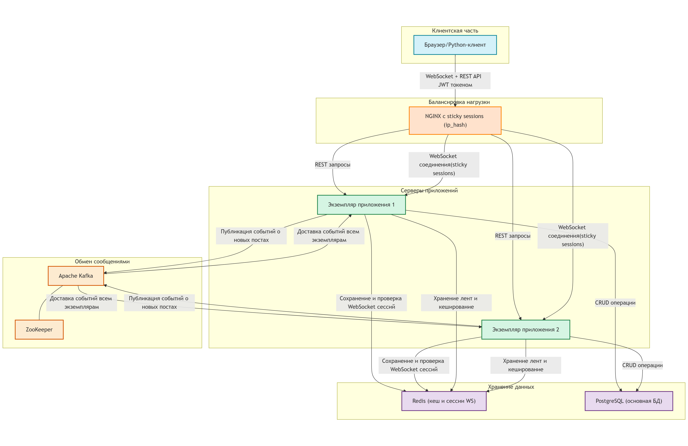
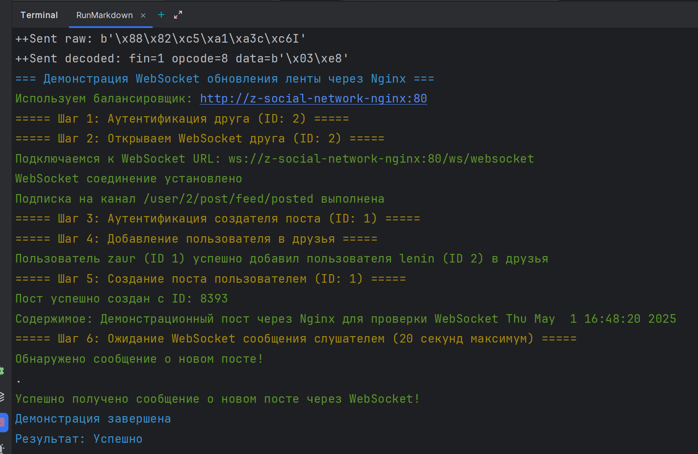

# Онлайн обновление ленты новостей

Реализация системы уведомлений о новых публикациях в социальной сети с использованием WebSocket.

## Архитектура решения



### Основные компоненты

- **WebSocket сервер** - обеспечивает двустороннюю связь с клиентами в реальном времени
- **Kafka** - используется для асинхронного формирования лент и отправки уведомлений
- **Redis** - кеширование лент и хранение информации о WebSocket сессиях

### Особенности реализации

1. **Отложенная материализация ленты**
    - Формирование лент работает через очередь Kafka (асинхронно)
    - При создании поста его содержимое мгновенно добавляется в базу данных
    - Уведомления о новых постах отправляются только активным пользователям через WebSocket

2. **Оптимизация для "эффекта Леди Гаги"**
    - Система определяет "знаменитостей" на основе количества подписчиков
    - Для постов от "знаменитостей" применяется специальная стратегия обновления лент

3. **Масштабируемость**
    - WebSocket соединения поддерживают масштабирование с помощью Redis и sticky sessions.
      Redis используется как централизованное хранилище информации об активных пользовательских сессиях, 
      что позволяет всем экземплярам приложения знать, какие пользователи находятся онлайн. 
      Дополнительно, NGINX с настроенной директивой ip_hash обеспечивает sticky sessions, 
      горантируя что все запросы от одного клиента всегда маршрутизируются на один и тот же версию приложения. 
    - Kafka может масштабироваться горизонтально добавлением брокеров и увеличением числа партиций


## Инструкция по запуску

### 1. Билдим проект и готовим образ
```bash
mvn -f ../backend/pom.xml clean package -Dmaven.test.skip=true && \
docker build --no-cache --build-arg CONFIG_FILE=application-feed.yaml -t zsalamandra/z-social-network-hw6 -f ../backend/Dockerfile ../backend  
```

### 2. Запуск проекта
```shell
docker-compose up -d
```

### 3. Тестирование функциональности

Для проверки осуществляется след последовательность:
1. Аутентификация двумя пользователями: создателем поста (zaur) и слушателем (lenin)
2. Устанавливается WebSocket-соединение от имени слушателя и подписывается на канал уведомлений о новых постах
3. Создаем дружескую связь между пользователями (если они еще не друзья)
4. Создаем новый демонстрационный пост от имени создателя
5. Ожидаем получения WebSocket-уведомления о созданном посте на стороне слушателя

```shell
# Сборка демонстрационного образа
docker build -t z-social-network-websocket-client ./websocket-demo
# Запуск демонстрации
docker run --rm --network=feed-online_social-network -e TARGET_HOST=z-social-network-hw6-app-1 z-social-network-websocket-client
```
логи теста:


5. Очистки
```bash
docker ps -q --filter "name=z-social-network*" | xargs -r docker stop && \
docker ps -aq --filter "name=z-social-network*" | xargs -r docker rm && \
docker images | grep "^zsalamandra/" | awk '{print $3}' | xargs -r docker rmi && \
docker network ls --filter "name=social-network$" -q | xargs -r docker network rm && \
docker volume ls -qf dangling=true | xargs -r docker volume rm
```