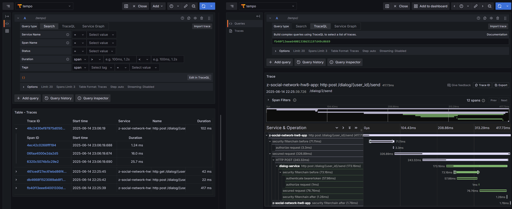

# Cервис диалогов (Tarantool) - в микросервис

## Цель
Разделить функциональность диалогов из монолита и вынести её в отдельный микросервис `dialog-service`. 
Организовать REST-взаимодействие между сервисами с использованием OAuth2 и сквозной авторизации.

## Архитектура

### Монолит:
    - генерирует JWT с `user_id`
    - вызывает `dialog-service` через Feign
### dialog-service:
    - получает ID текущего пользователя из токена
    - работает с Tarantool напрямую (через Java-клиент и вызовы `box.func`)
### Безопасность:
    - На новом микросервисе используется `spring-boot-starter-oauth2-resource-server`
    - JWT валидируется и на стороне `dialog-service`

## Эндпоинты

- `POST /dialog/{user_id}/send` — отправка сообщения
- `GET /dialog/{user_id}/list` — список сообщений

## Передача user_id

- В монолите токен генерируется с `user_id` как claim.
- В `dialog-service` user_id отправителя извлекается из токена, 
  а получателя из параметра `user_id` в URL.

## Сквозное логирование (trace-id / x-request-id)

Для анализа производительности и ошибок использавал распределённый трейсинг:

 - Реализовал трейсинг с помощью Micrometer Tracing и OpenTelemetry. 
 - Настроил экспорт через OTLP в otel-collector, далее в Tempo. 
 - Трейсы отправляются как из монолита, так и из dialog-сервиса. 
 - При переходе запроса между сервисами trace-id сохраняется, видно в Grafana Tempo вся цепочка вызовов.



## Обратная совместимость

Старое API не удалял. Монолит обрабатывает старые запросы и внутри вызывает dialog-service. 
Таким образом, старые клиенты продолжают работать, а новая логика реализована уже в микросервисе.

# Инструкция по запуску

## 1.1 Сборка проекта монолита
```shell
mvn -f ../backend/pom.xml clean package -Dmaven.test.skip=true && \
docker build --no-cache --build-arg CONFIG_FILE=application-dialog-service.yaml -t zsalamandra/z-social-network-hw8 -f ../backend/Dockerfile ../backend
```

## 1.2 Сборка проекта сервиса диалогов
```shell
mvn -f ../dialog-service/pom.xml clean package -Dmaven.test.skip=true && \
docker build --no-cache --build-arg CONFIG_FILE=application.yaml -t zsalamandra/z-social-network-dialog-hw8 -f ../dialog-service/Dockerfile ../dialog-service
```

## 2 Запуск проекта
```shell
docker compose up -d z-social-network-hw8
```

### 3 Прогон теста с помощью jmeter
```bash
docker-compose run --name z-social-network-jmeter -v \results:/results jmeter
```
Результаты:
```
Операция               Запросов   Мин(мс)   Медиана   Макс(мс)  Throughput
---------------------- --------- --------- --------- --------- ---------
Отправка сообщений      1000      10        34        261       193.72   
Получение сообщений     1000      7         30        299       200.40
```

Очистки
```bash
docker ps -q --filter "name=z-social-network*" | xargs -r docker stop && \
docker ps -aq --filter "name=z-social-network*" | xargs -r docker rm && \
docker images | grep "^zsalamandra/" | awk '{print $3}' | xargs -r docker rmi && \
docker network ls --filter "name=social-network$" -q | xargs -r docker network rm && \
docker volume ls -qf dangling=true | xargs -r docker volume rm
```