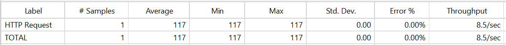
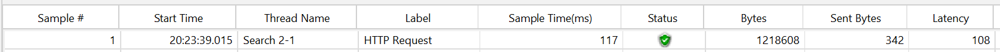
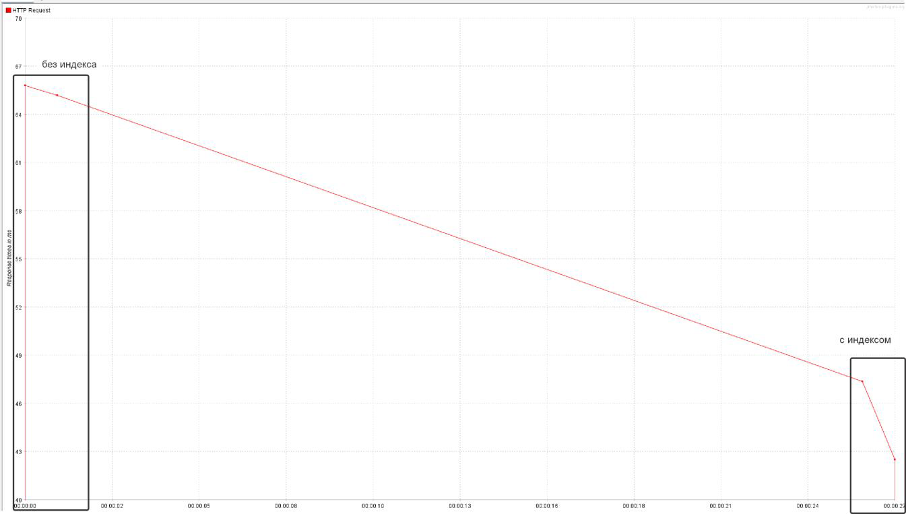
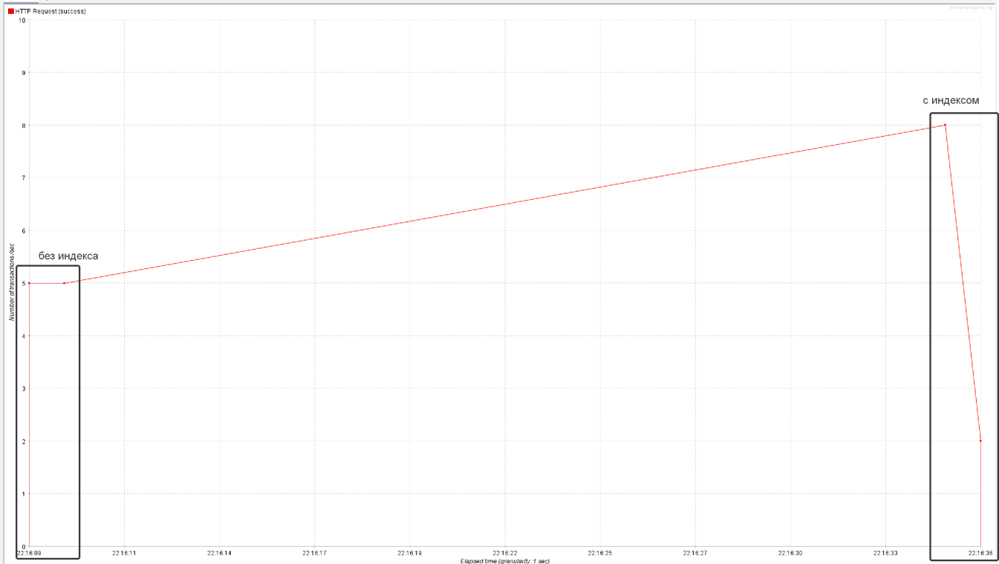
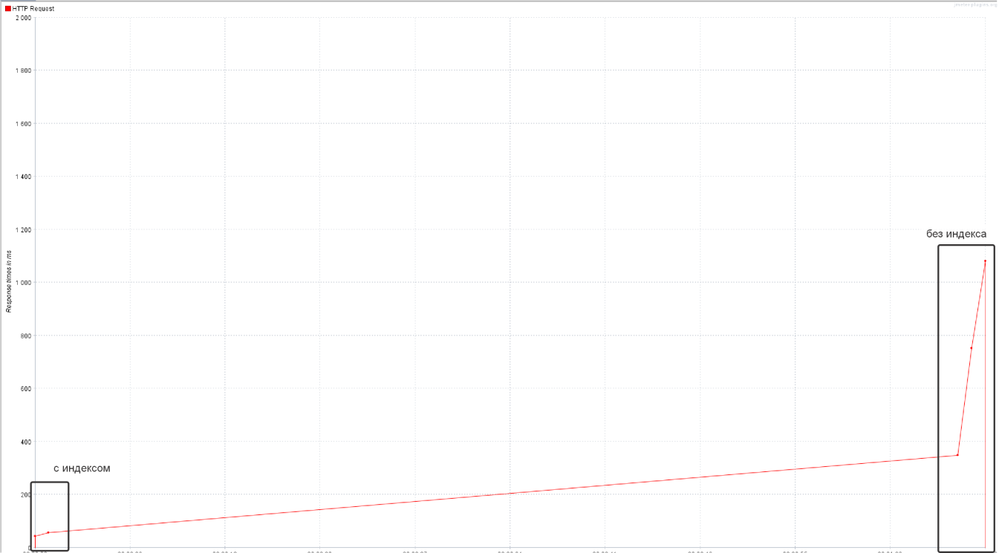
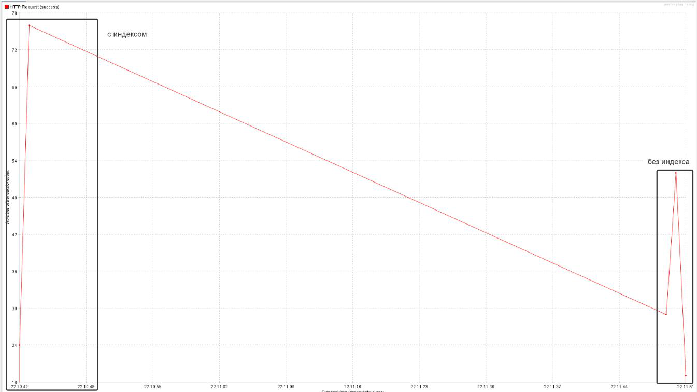
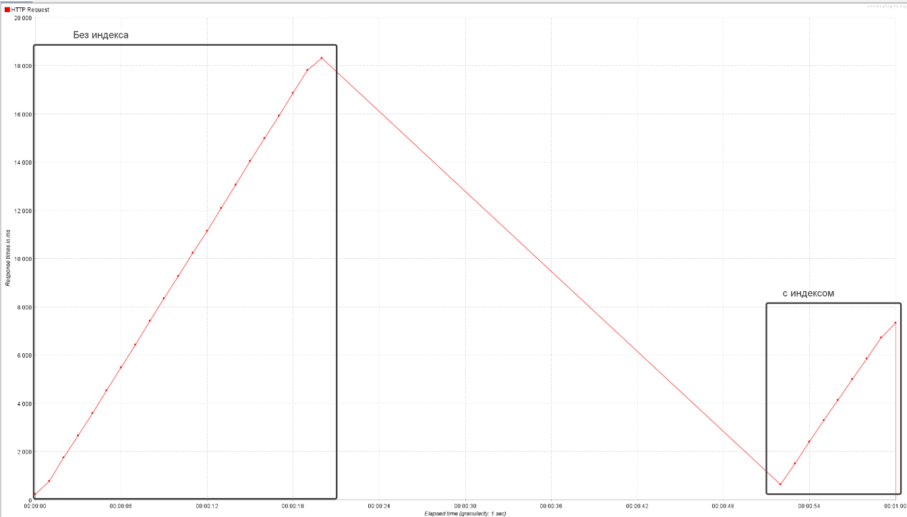
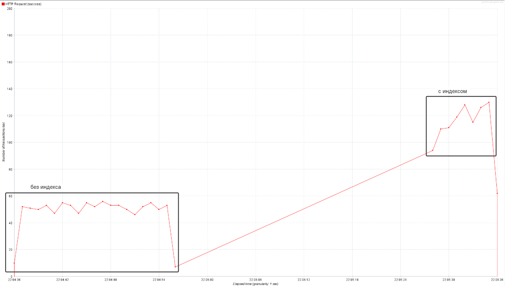
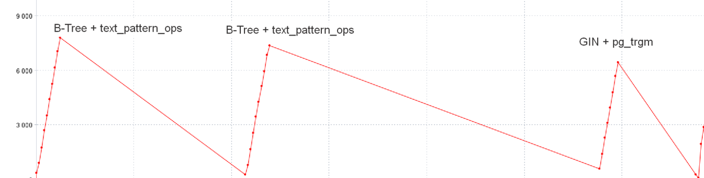

# HOMEWORK-2

## Задание: Оптимизация запросов

### Индексация таблицы `users`

**SQL запрос для создания индекса:**
```sql
CREATE INDEX idx_users_first_name_trgm ON users USING gin (
    first_name gin_trgm_ops,  
    last_name gin_trgm_ops
);
```

### Цель индексации

Индекс создан для оптимизации следующего запроса:
```sql
SELECT * FROM users WHERE first_name LIKE ? AND last_name LIKE ? ORDER BY id;
```

### Выбор GIN индекса с pg_trgm

Использован GIN (Generalized Inverted Index) с pg_trgm для полей `first_name` и `last_name`. Это решение выбрано по следующим причинам:
- **Поиск по префиксам:** GIN индекс отлично подходит для поиска с использованием префиксов (например, `LIKE 'A%'`).
- **Триграммы:** Расширение `pg_trgm` разбивает текст на триграммы, что увеличивает производительность при поиске по начальной части строки.
- **Объем данных:** GIN индекс показывает более высокую производительность при увеличении объема данных и сложных текстовых фильтрах.

### Порядок индексации

Индекс создан на `first_name` и `last_name` в таком порядке:
1. Сначала выполняется фильтрация по `first_name`.
2. Затем уточняется поиск по `last_name`.

Этот порядок оптимизирует использование индекса для фильтрации.

### Сравнение с B-tree

- **B-tree:**
    - Подходит для точных соответствий и диапазонов.
    - Менее эффективен для текстового поиска с префиксами.
- **GIN + pg_trgm:**
    - Обеспечивает более высокую производительность при текстовом поиске.
    - Особенно эффективен при больших объемах данных.

### Анализ производительности

Для подтверждения эффективности индекса выполнен анализ запроса с помощью `EXPLAIN ANALYZE`:
```sql
EXPLAIN ANALYZE SELECT * FROM users WHERE first_name LIKE 'А%' AND last_name LIKE 'В%' ORDER BY id;
```

**Результаты анализа:**
```
Gather Merge  (cost=12591.16..13221.21 rows=5400 width=625) (actual time=3.566..6.042 rows=6193 loops=1)
  Workers Planned: 2
  Workers Launched: 2
  ->  Sort  (cost=11591.14..11597.89 rows=2700 width=625) (actual time=1.473..1.581 rows=2064 loops=3)
        Sort Key: id
        Sort Method: quicksort  Memory: 851kB
        Worker 0:  Sort Method: quicksort  Memory: 118kB
        Worker 1:  Sort Method: quicksort  Memory: 146kB
        ->  Parallel Bitmap Heap Scan on users  (cost=98.43..11437.26 rows=2700 width=625) (actual time=0.461..1.236 rows=2064 loops=3)
              Recheck Cond: (((first_name)::text ~~ 'А%'::text) AND ((last_name)::text ~~ 'В%'::text))
              Heap Blocks: exact=585
              ->  Bitmap Index Scan on idx_users_first_name_trgm  (cost=0.00..96.81 rows=6481 width=0) (actual time=1.259..1.260 rows=6193 loops=1)
                    Index Cond: (((first_name)::text ~~ 'А%'::text) AND ((last_name)::text ~~ 'В%'::text))
Planning Time: 0.190 ms
Execution Time: 6.298 ms
```

### Результаты тестирования

#### Однопоточная обработка:
- **Summary Report:**
  
- **Results in Table:**
  
#### 10 потоков:
- **Среднее время отклика:** 
- **Пропускная способность:** 

#### 100 потоков:
- **Среднее время отклика:** 
- **Пропускная способность:** 

#### 1000 потоков:
- **Среднее время отклика:** 
- **Пропускная способность:** 
- 
#### 1000 потоков (сравнение B-tree и GIN):
- **Среднее время отклика:** 

### Вывод

Использование GIN индекса с расширением `pg_trgm` значительно улучшает производительность запросов, особенно при работе с текстовыми полями и большими объемами данных. Рекомендуется использовать данное решение для задач, где часто требуется поиск по префиксам или частям строк.

