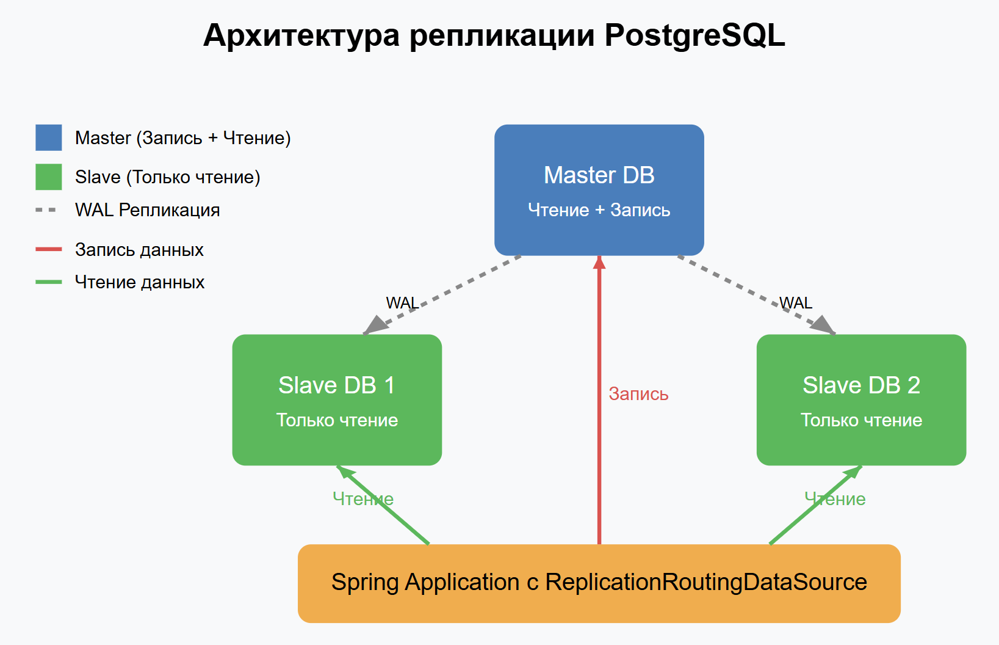

# Репликация

## 1. До репликации делаем нагрузочное тестирование и получаем отчет

### 1.1. Билдим проект и готовим образ
```bash
mvn -f ../backend/pom.xml clean package -Dmaven.test.skip=true && \
docker build --no-cache --build-arg CONFIG_FILE=application.yaml -t zsalamandra/z-social-network-hw3 -f ../backend/Dockerfile ../backend  
```

### 1.2. Запуск проекта и БД, пока не реализовали репликацию
```bash
docker-compose -f \async\\docker-compose.yaml up -d z-postgres-master z-social-network-hw3
```

### 1.3. Запуск теста (только мастер)
До репликации создадим нагрузку с помощью Jmeter, она запускается в контейнере 
и отправит запросы на следующие эндпойнты:
 - /profile (будем искать юзеров, чье first_name = A и last_name = B)
 - /get-user (будем получать юзеров с id от 1 до 40 в случайном порядке)
в 1000 потоков, Ramp - 1s. 

На основе /testplan/Dockerfile собран образ, скрипт testplan/report.sh извлекает из файла 
statistics.json данные для итогового отчета, а в testplan/TestPlan-HW3.jmx - сам файл тестирования

ВНИМАНИЕ: перед запуском теста нужно дождаться полного запуска сервиса
```bash
# Удаляем старые результаты если они есть
rm -rf async/results && mkdir -p async/results && 
# Пересоздаем контейнер с пересборкой
docker-compose -f async/docker-compose.yaml up -d --build --force-recreate jmeter &&
# Смотрим логи, ждем не спеша
docker-compose -f async/docker-compose.yaml logs -f jmeter
````

Результат (у меня в базе были все записи с people.csv):
```
Транзакция      Запросов     Мин (мс)     Медиана (мс) Макс (мс)       Throughput
--------------- ------------ ------------ ------------ --------------- ------------
get-user        488          2            11           2647            60.73       
profile         512          72           1056.5       4420            64.54
--------------- ------------ ------------ ------------ --------------- ------------
TOTAL           1001         2            224          4420            112.48
```

### 1.4 Очистки
```bash
docker ps -q --filter "name=z-social-network*" | xargs -r docker stop && \
docker ps -aq --filter "name=z-social-network*" | xargs -r docker rm && \
docker images | grep "^zsalamandra/" | awk '{print $3}' | xargs -r docker rmi && \
docker network ls --filter "name=social-network$" -q | xargs -r docker network rm
```


## 2. Асинхронная потоковая репликация



### 2.1 Настроил Master-Slave репликацию с одним мастером и двумя репликами:

Master-узел принимает все операции записи
Два Slave-узла используются для операций чтения (в сервисе реализовал интеграцию только с одним слейвом)

В сервисе реализован маршрутизатор для направления запросов к нужному узлу - 
создал ReplicationRoutingDataSource, который наследуется от AbstractRoutingDataSource, 
ключевой метод которого - determineCurrentLookupKey() проверяет, является ли транзакция readOnly 
и соответственно направляет запрос на Master или Slave.

На Master-сервере PostgresSQL:
* Установлен wal_level = replica для включения WAL-логирования
* Настроен max_wal_senders = 4 для поддержки до 4 реплик
* Создан пользователь replicator с правами репликации

На Slave-серверах:
* Включен hot_standby = on для возможности чтения данных с реплики
* Настроена hot_standby_feedback = on для минимизации конфликтов репликации
* Определено соединение с мастером через primary_conninfo
* При подготовке бекапа создается файл standby.signal внутри этой папки, чтоб slave понял, что он slave

Все настройки произведены в файлах: 
/master/postgresql.conf     - настройки репликации тут
/master/pg_hba.conf         - создал пользака replicator дал права
/master/init-replication.sh - создан пользователь
/master/Dockerfile          - создаю контейнер для запуска
/slave1(2)/postgresql.conf  - настройки репликации тут
/slave1(2)/pg_hba.conf      - пользователю replicator дал права

Нагрузочное тестирование:
Для измерения эффективности репликации используется те же тесты JMeter, 
которые генерируют нагрузку на два эндпоинта:
- /profile (будем искать юзеров, чье first_name = A и last_name = B)
- /get-user (будем получать юзеров с id от 1 до 40 в случайном порядке)

Тесты запускаются в 1000 потоков и позволяют сравнить производительность до и после внедрения репликации.

### 2.2 Сборка проекта и создание Docker образа сервиса

Сборка образа происходит с другим конфиг файлом - application-async.yaml, в котором определены и слейвы
```shell
mvn -f ../backend/pom.xml clean package -Dmaven.test.skip=true && \
docker build --no-cache --build-arg CONFIG_FILE=application-async.yaml -t zsalamandra/z-social-network-hw3 -f ../backend/Dockerfile ../backend  
```

### 2.3 Поднимаем сервис и мастер базу данных 'postgres-master'

```shell
docker-compose -f \async\\docker-compose.yaml up -d z-postgres-master z-social-network-hw3
```

### 2.3 Делаем бекап мастера в директории для слейвов
```shell
mkdir -p "async/backup" &&
docker exec -it z-social-network-hw3-postgres-master bash -c "pg_basebackup -h z-social-network-hw3-postgres-master -D /tmp -U replicator -v -P --wal-method=stream" &&
touch ./async/backup/standby.signal &&
mkdir -p ./async/slave-1/postgres-data && cp -r ./async/backup/* ./async/slave-1/postgres-data/ &&
mkdir -p ./async/slave-2/postgres-data && cp -r ./async/backup/* ./async/slave-2/postgres-data/
```

### 2.4 Запускаем слейвы
```shell
 docker-compose -f \async\\docker-compose.yaml up -d z-postgres-slave-1 z-postgres-slave-2
```

### 2.5 Проверим состояние репликации (надо подождать сек 10)
```shell
$ docker exec -it z-social-network-hw3-postgres-master psql -U root -d z-social-network -c "SELECT application_name, state, sync_state FROM pg_stat_replication;"
```
Ответ:
```
 application_name |   state   | sync_state 
------------------+-----------+------------
 slave-1          | streaming | async
 slave-2          | streaming | async
(2 rows)
```

### 2.6 Проверим репликацию путем записи в мастер строки и вычитки его со слейвов
```shell
#Вставляем тестовую запись в master
docker exec -it z-social-network-hw3-postgres-master psql -U root -d z-social-network -c \
"INSERT INTO users (first_name, last_name, birth_date, city, username, password) VALUES ('test_user', 'test_last', '2024-01-01', 'Test City', 'test_user', 'test_pwd');"

# Ждем секунду для репликации
sleep 1

# Проверяем запись на master
docker exec -it z-social-network-hw3-postgres-master psql -U root -d z-social-network -c \
"SELECT * FROM users WHERE first_name = 'test_user';"

# Проверяем запись на slave-1
docker exec -it z-social-network-hw3-postgres-slave-1 psql -U root -d z-social-network -c \
"SELECT * FROM users WHERE first_name = 'test_user';"

# Проверяем запись на slave-2
docker exec -it z-social-network-hw3-postgres-slave-2 psql -U root -d z-social-network -c \
"SELECT * FROM users WHERE first_name = 'test_user';"
```

### 2.7 Проверим c помощью JMeter
```bash
# Удаляем старые результаты если они есть
rm -rf async/results && mkdir -p async/results && 
# Пересоздаем контейнер с пересборкой
docker-compose -f async/docker-compose.yaml up -d --build --force-recreate jmeter &&
# Смотрим логи, ждем не спеша
docker-compose -f async/docker-compose.yaml logs -f jmeter
````
Результат:
```
 Транзакция      Запросов     Мин (мс)     Медиана (мс) Макс (мс)       Throughput
--------------- ------------ ------------ ------------ --------------- ------------
get-user        498          4            741          6111            44.46       
profile         502          77           1903         6344            44.60
--------------- ------------ ------------ ------------ --------------- ------------
TOTAL           1001         4            1003         6344            80.94
```
_В целом, производительность просела, думаю, что это из-за того что spring'у приходится
маршруты выбирать на мастер идти или на слейв, это добавляет задержки. И LazyConnectionDataSourceProxy
тоже вносит задержку, делая коннект к БД в момент первого запроса_

### 2.8 Очистимся
```shell
docker ps -q --filter "name=z-social-network*" | xargs -r docker stop && \
docker ps -aq --filter "name=z-social-network*" | xargs -r docker rm && \
docker images | grep "^zsalamandra/" | awk '{print $3}' | xargs -r docker rmi && \
docker network ls --filter "name=social-network$" -q | xargs -r docker network rm && \
rm -rf ./async/backup ./async/slave-1/postgres-data ./async/slave-2/postgres-data
```


## 3. Настроить кворумную синхронную репликацию.

### 3.1. Билдим проект и готовим образ

Используем application-sync.yaml, подключение будет производиться через haproxy+keepalive
```bash
mvn -f ../backend/pom.xml clean package -Dmaven.test.skip=true && \
docker build --no-cache --build-arg CONFIG_FILE=application-sync.yaml -t zsalamandra/z-social-network-hw3 -f ../backend/Dockerfile ../backend  
```

### 3.2. Запуск всех сервисов 

Им нужно будет время чтоб etcd по рафту лидера выбрали себе, 
чтоб патрони кластер выбрал мастера 
и чтоб сервис смог подключиться к БД и проиницииализировать
```bash
docker-compose -f \patroni\\docker-compose.yaml up -d etcd1 etcd2 etcd3 postgres1 postgres2 postgres3 haproxy-master haproxy-backup z-social-network-hw3
```

### 3.3 Проверим как функционирует кластер

Запускаем тестовый контейнер с автоматическими скриптами
Реализовано 5 проверок:
* Тестирование подключения к мастеру - ломимся в цикле через keepalive в postgres (порт 5000)
* Тестирование подключения к репликам - ломимся в цикле через keepalive в postgres только на порту 5001
* Мониторинг состояния кластера Patroni - тут ломимся по порту 8008 через API Patroni
* Тестирование записи в кластер - через морду кластера - keepalive на порту 5000 пишем раз в сек запись, с отчетом об успехе/неуспехе
* Тестирование отказоустойчивости и синхронной репликации - проверяем что когда мастер отваливается, патрони другого толкает в мастера 
и проверяем, что записи не теряем когда он восстанавливается (во время тестирования будут подробные подсказки) 

```bash
docker-compose -f \patroni\\docker-compose.yaml up -d replication-test && \
docker exec -it z-social-network-test bash -c "\/app\/run.sh"
```

### 3.3 Очистимся
```shell
docker ps -q --filter "name=z-social-network*" | xargs -r docker stop && \
docker ps -aq --filter "name=z-social-network*" | xargs -r docker rm && \
docker images | grep "^zsalamandra/" | awk '{print $3}' | xargs -r docker rmi && \
docker network ls --filter "name=social-network$" -q | xargs -r docker network rm && \
rm -rf ./patroni/etcd1/data ./patroni/etcd2/data ./patroni/etcd3/data ./patroni/postgres/postgres1/data ./patroni/postgres/postgres2/data ./patroni/postgres/postgres3/data
```